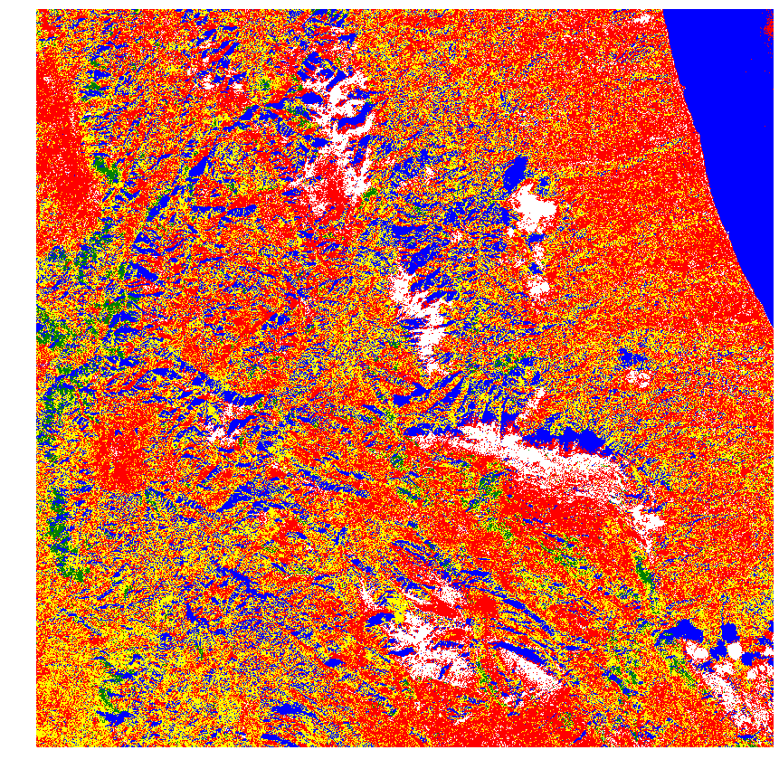
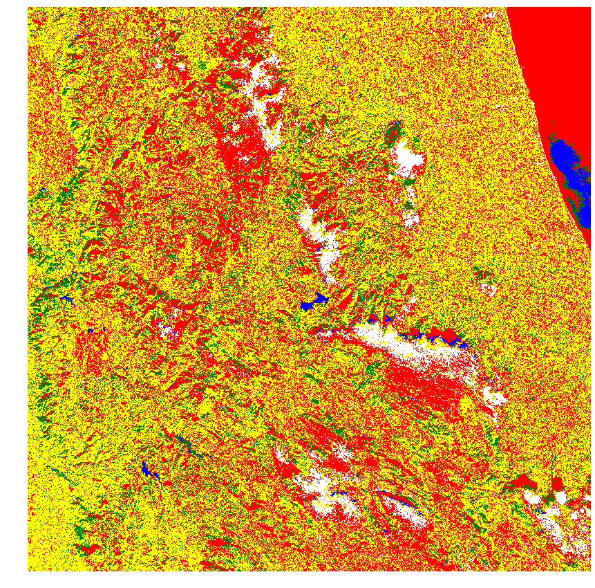

# Land Cover Classification

This repository provides the necessary data for running/training a simple land cover classification model that is capable of classifing 5 different classes given a set of satellite images.

## 1. Introduction

The land cover classification repository contains two different directories; ___trainingModel___ and ___workingModel___. If you are not interested in training a new model then you should navigate to the workingModel directory as this directory conains all the necessary parts for running a land model classification on a local browser by means of a Docker container. However, if you are intersted in training your own model, then you should navigate to the trainingModel directory and there you can train your model by running the ___landCoverClassification.ipynb___ and replacing the already existing training images with your own images (read 2.1 for more details on making a training data set).

## 2. Model Training

In order to train a land cover classification model, one needs a training set and a test set. Below you can find a short description of the processes through which a training set and a test set were prepared. However, before that data acquisition process will be explained.

### 2.1 Satellite Imagery Acquisition

All the acquired satellite imageries in this work were collected from [EO Browser](https://www.sentinel-hub.com/explore/eobrowser). However, for the purpose of this work the required satellite imageries are provided in the ___trainingImage___ directory under the ___trainingModel___ directory (see 3 for file system structure of this repository). It is important to note that this model works based on monochromatic images of a given area. It means that unlike a true color image that has three RGB channels here (for both training and test steps) instead of one three-channel image we need to have four separate images of the same area each of which containing intensity values of a specific band (i.e. R, G, B, and infrared). To download such images from EO Browser one has to create an account on EO browser.

### 2.2 Band Numbering and Image Names

Once the user has downloaded an image from the EO browser the image name (by default) will be something similar to the following:

> 2020-01-11, Sentinel-2B L1C, B08.png

The above line shows the name of the image extracted from the EO Browser zip file along with three other images. The date/first part of the name shows the date at which the image was taken by the satellite. The second part (i.e. Sentinel-2B L1C) shows the name of the satellite that took the image. And the last part (i.e. B08) indicates that this image holds the intensity values of this band which in this case B08 shows this image holds the intensity values of the infrared band. B04, B03, and B02 represent red, green, and blue bands respectively (see [this](https://sentinel.esa.int/web/sentinel/user-guides/sentinel-2-msi/resolutions/spatial) for more details on bands in sentinel 2 satellite). 

The user should note that for the purpose of this work the original names of the files were altered. In order to be able to run the model (in section 5) the user has to convert the name of the test images (for each of the four bands) from the original names to new names by replacing the date part of the file name with the word ___image___ (see the line below)

> from 2020-01-11_Sentinel2_B08.png === to ===> ___image____Sentinel2_B08.png

The user can change this behavior of the code by navigating to the ___trainingModel___ ---> ___landCoverClassification.ipynb___ ---> ___testSet___. There you can change the word image by any other words or completely remove this behavior of thr code.

### 2.3 Training Data Set

The aim is to create a ___CSV___ file with 5 different columns including ___red___, ___green___, ___blue___, ___infrared___ pixel intensities, and ___land cover type___. Each row in this CSV file represents a pixel in the monochromatic training images. Pixel values of all four images/bands are read simultaneously and stored in each row and column of the traingingSet.CSV file. For instance, the water image in the training directory contains 1265 x 810 pixels. This means that at the end of the process there will be a dataframe with 1,024,650 (1265 x 810) rows each for a pixel. There are alos five columns of which four show band intensities (pixel values) and the last column filled with letter ___w___ that stands for water. This process is done for five different classes of images each representing a land cover type.

### 2.4 Test Data Set

Test set preparation process is similar to the training set preparation process with the exception that there is no class column as we are going to predict the class of each pixel based on the given pixel values (see 2.3 for more details on data set preparation process). The image used for test set preparation is stored in the ___testImage___ directory under the ___trainingModel___ directory (see ___sec.___ 3 for more details).


## 3. Land Cover Classification Repository Tree

The following tree shows the contents of this repository, 

```bash
root(landCoverClassifiation)
|   
|___ /workingModel
|   |
|   |___ /templates
|   |    |___ index.html
|   |    |___ resutl.html
|   |
|   |___ /uploads
|   |    |___ .png images
|   |
|   |___ ml.py
|   |
|   |___ api.py
|   |
|   |___ visual.py
|   |
|   |___ convert.py
|   |
|   |___ model.pk
|   |
|   |___ Dockerfile
|   |
|   |___ requirements.txt
|      
|___/trainingModel
|   |
|   |___ landCover.ipynb
|   |
|   |___/trainingImage
|   |   |___some images for training
|   |
|   |___/testImage
|   |   |___some images for testing

```

Where in the following each content is briefly explained.

### 3.1 Content Description

___templates___: contains two html files; ___index.html___ and ___result.html___. The two files are used in the ___api.py___ code to create an html page and give the ability to load the required images to run the classification model. 

___uploads___: contains images to be uploaded in the html page.

___api.py___: will provide the interface between the docker container and the user. It provides an html page where the user can upload their images. Once the images are uploaded it calls the ___convert.py___ for creating a dataframe from the uploaded images. Once the dataframe is ready it will call the ___ml.py___ to run the trained land cover calssification on dataframe. Finally, it will call the ___visual.py___ to create a semantic map of the uploaded images based on the output of the ___ml.py___. 

___model.pk___: this is our ___trained___ land cover classification model. The ___.pk___ extension shows the model has been pickled to be transferable. (The pickling process is done using ___pickle___ package in python.) 

___Dockerfile___: it is used to create an ubuntu 18.04 slim version. Once the ubuntu image is created the user needs to create a container using created image (see ___sec.___ 4 for more details on docker container creation).

## 4. Docker Container

Docker container plays an important role in this work. Once the machine learning model is ready the user has to put the model into a docker container. It is important to follow the order. A docker container is built upon a docker image and a docker image is built upon a dockerfile. A dockerfile provides all the necessary ingredients for creating a docker image (and later a container) with specific feature for a specific task. For the purpose of this work a dockerfile has been provided (see section 3). 

To build a docker image the user needs to type in the following command in the terminal (see [docker build](https://docs.docker.com/engine/reference/commandline/image_build/) for more details)

> docker image build -f Dockerfile

Where the Dockerfile is the file that exist in the current directory. It takes several minutes to build the image. Once the image is ready the user can build the container from the image. This can be accomplished by the following command (see [docker create](https://docs.docker.com/engine/reference/commandline/create/) for more details on different flags).

> docker create -p 5000 -t -i --name containerName Image

The above command is an example of the possible options/flags one can provide to create a docker container. The above command will create a container with the given containerName from the Image (the one we built in the previous step). Also, it exposes the port 5000 of the container to the local host (you can expose other ports too).

A container may stop running for a variety of reasons. The status of container can be checked by the following command 

> docker ps --all

Where the above command lists all existing containers and shows their status. If a given container has stopped working one can restart the container using the following command (see [docker restart](https://docs.docker.com/engine/reference/commandline/restart/) for more details). 

> docker restart docker name/id

Given a docker name or id the the above command will restart the container. If the user wants to have direct access to a docker container the following command will help you to do so (see [docker exec](https://docs.docker.com/engine/reference/commandline/exec/) for more details).

> docker exec -i -t dockerName-id /bin/bash

Given a docker name or id the above command will connect the user directly to the container's shell and the user can navigate inside the container. To connect to the container through local machine's web browser the user has to type in ___172.17.0.3:5000___ in the web browser. This will connect the local host/machine the container. The 172.17.0.3 address is the container's ip address and 5000 is the port of the container through which the container is exposed to the local host. The above ip address can be seen by typing in the following command in the terminal.

> docker inspect containerName-or-id

## 5. Running the Model

Once you have downloaded/cloned the repository, use ___Dockerfile___ to create a docker image and then a docker container and make sure the container is running (see ___sec.___ 4 for more details). Next, type in the browser "___172.17.0.3:5000___" (see ___sec.___ 4 for more details). Then, an ___html___ page will pop up and asks you to upload your images. Up load your test images and click on ___upload___ button. After a few minutes (depending on how big your input images are) you will receive a message stating "Processing done!". This means the classification is over. The user should note that the image needs to be transfered from the container to local machine manually. This can be done by [cp](https://docs.docker.com/engine/reference/commandline/cp/) command (see an example below).

> docker cp [OPTIONS] CONTAINER-Name-or-ID:path_to_image_in_docker_container path_to_a_location_on_local_machine

> e.g. ===> docker cp 9314b568d859:/home/docker/thematicMap.png .

The above line in the example transfers ___thematicMap.png___ stored at ___/home/docker/___ inside the container with the id ___9314b568d859___ to ___.___ the current directory on our local machine.


## 5. Performance

Given that the model is simple and no feature enginering was involved, one cannot expect an accurate output. However, it is possible to train a more accurate model by providing a more diverse set of training images of each land cover type. An example of this is shown below. ___Fig. 1___ shows the output of a model trained on 100 training pixels from each class. ___Fig. 2___ shows the true color image of the same area. And ___Fig. 3___ shows the output of a model trained on 50,000 pixels from each land cover type. In ___Fig. 1___, shadows are detected as water bodies while this issue has been resolved in the second model where this model is well capable of detecting inland water bodies (___Fig. 3___). However, the second model fails to detect the ocean water (___Fig. 3___ top right hand corner). On the contrary, the first model (___Fig. 1___) is good at detecting ocean water unlike the first model.

<figure>
  <figcaption>Fig.1: Trained on 100 pixles.</figcaption>
  
</figure>
<figure>
  <figcaption>Fig.2: True color image.</figcaption>
  
</figure>
<figure>
  <figcaption>Fig.3: Trained on 50,000 pixles.</figcaption>
  
</figure>
